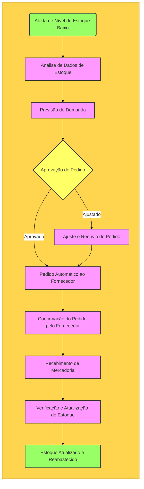
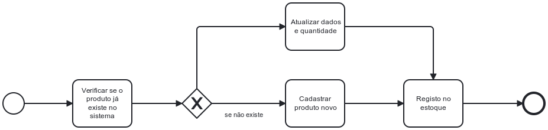
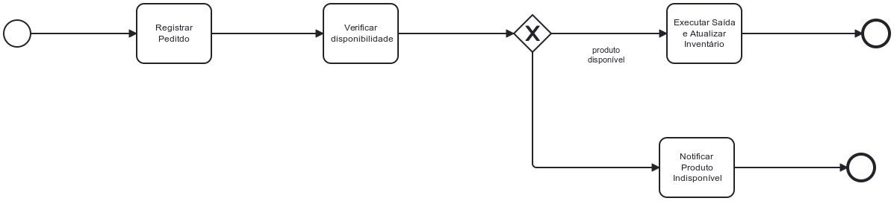
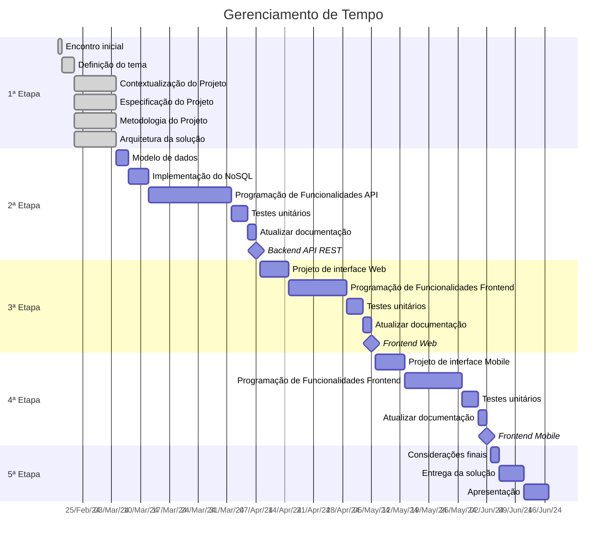
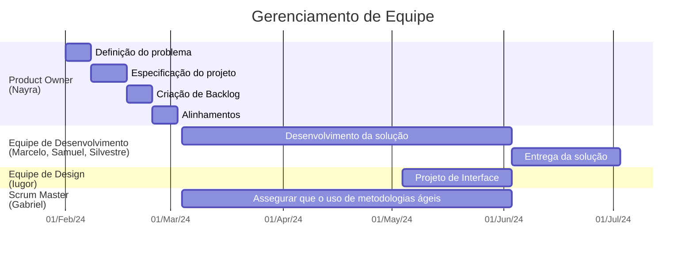

# Especificações do Projeto

Pré-requisitos: <a href="1-Documentação de Contexto.md"> Documentação de Contexto</a>

A empresa de varejo enfrenta desafios críticos relacionados ao gerenciamento de estoque, incluindo excesso ou falta de produtos, ineficiências logísticas, dificuldades na previsão de demanda e na reposição de estoque, impactando negativamente a operação e a experiência do cliente.

O objetivo deste projeto é desenvolver um sistema de gerenciamento de estoque integrado, capaz de transformar a maneira como uma empresa de varejo opera, tornando-a mais eficiente, responsiva e adaptável às demandas do mercado. A solução proposta visa abordar diversos desafios enfrentados pela empresa, melhorando significativamente a gestão de estoque.

## Personas

### Sayori - Gerente de Operações </h2>
 
 

 
> ### História de usuário
> Sayori, Gerente de Operações em uma empresa de varejo, utiliza um sistema de gerenciamento de estoque para manter a disponibilidade de produtos e minimizar perdas. Ela inicia o dia analisando relatórios e dashboards que mostram os níveis de estoque, produtos mais vendidos e itens com baixo estoque, recebendo notificações automáticas para reabastecimentos necessários. Em reuniões estratégicas, ela emprega esses dados para otimizar o estoque, ajustando os pedidos conforme a demanda sazonal. Esse sistema permite a Sayori tomar decisões informadas, equilibrando oferta e demanda e contribuindo significativamente para o sucesso da empresa.

 
 - Acesso fácil e rápido às informações do estoque.
 - Relatórios detalhados para tomar decisões estratégicas.
 - Notificações automáticas para reabastecimento de produtos. 

### Carlos - Coordenador de Logística 

> ### História de usuário
> Carlos é responsável pela logística de uma empresa de distribuição. Ele precisa de um sistema que o ajude a otimizar a movimentação de produtos, garantindo entregas pontuais e eficientes.
Um Coordenador de Logística, busca um sistema de gerenciamento de estoque que o auxilie na otimização da movimentação de produtos para garantir entregas pontuais. Ele necessita de funcionalidades como rastreamento em tempo real, integração com sistemas de transporte e alertas automáticos para enfrentar desafios logísticos. Ao utilizar essas funcionalidades, Carlos consegue coordenar eficientemente as entregas, planejar rotas adequadas e tomar ações proativas diante de possíveis atrasos, contribuindo para a eficiência operacional e satisfação dos clientes. O sistema torna-se uma peça fundamental para o sucesso da cadeia de distribuição da empresa.
 
 - Rastreamento em tempo real do estoque e movimentação de produtos.
 - Integração com sistemas de transporte para coordenar entregas.
 - Alertas automáticos para possíveis atrasos ou problemas logísticos.

### Mateus - Analista de Compras 

> ### História de usuário
> Mateus, Analista de Compras, busca um sistema que o ajude a gerenciar eficientemente os estoques e a realizar pedidos de forma assertiva. Com funcionalidades como rastreamento em tempo real, integração com transporte e alertas automáticos, ele garante reposições oportunas e ações proativas diante de possíveis desafios logísticos. O sistema torna-se essencial para a eficiência do departamento de compras e contribui para um fluxo contínuo no processo de abastecimento.

 - Rastreamento em tempo real do estoque e movimentação de produtos.
 - Integração com sistemas de transporte para coordenar entregas.
 - Alertas automáticos para possíveis atrasos ou problemas logísticos.

### Rafaela - Operadora de Caixa

> ### História de usuário
> Rafaela, Operadora de Caixa, busca um sistema que forneça informações instantâneas sobre o estoque para atender clientes de forma eficiente. Com funcionalidades como disponibilidade em tempo real, alertas automáticos para produtos em baixa e facilidade de consulta, Rafaela garante um atendimento ágil, evita falta de produtos e responde prontamente às dúvidas dos clientes, contribuindo para uma experiência positiva no ponto de venda. O sistema torna-se essencial para melhorar a eficiência do atendimento ao cliente no varejo.
 - Disponibilidade em tempo real das informações de estoque.
 - Alertas para produtos fora de estoque ou com quantidade baixa.
 - Facilidade de consulta para responder a dúvidas dos clientes sobre a disponibilidade de produtos.

## Modelagem do Processo de Negócio 

### Análise da Situação Atual

Atualmente, a empresa de varejo enfrenta diversos desafios no gerenciamento de seu estoque, principalmente devido à falta de automação e integração nos processos existentes. A maior parte do controle de estoque é realizada manualmente ou por meio de sistemas isolados, que não se comunicam eficientemente entre si ou com fornecedores e sistemas de logística. Isso resulta em:

 - Desafios de Precisão: Erros humanos na entrada de dados e no acompanhamento de estoque levam a discrepâncias significativas entre o estoque registrado e o físico.
 - Demora na Reação: A falta de dados em tempo real sobre o nível de estoque atrasa a identificação de necessidades de reabastecimento, resultando em excesso de estoque ou, pior, em rupturas que afetam a satisfação do cliente.
 - Ineficiências Operacionais: Sem automação, o tempo gasto para gerenciar o estoque é substancial, desviando recursos de atividades mais estratégicas.
 - Decisões Baseadas em Intuição: A ausência de relatórios analíticos dificulta a tomada de decisão baseada em dados, tornando as compras e o planejamento de estoque menos eficazes

### Descrição Geral da Proposta

A proposta visa desenvolver e implementar um sistema integrado de gerenciamento de estoque que se alinhe com os objetivos estratégicos do negócio e aborde os problemas identificados na análise da situação atual. Este sistema buscará:

 - Automatizar o Controle de Estoque: Utilizando tecnologia para rastrear e gerenciar o inventário em tempo real, reduzindo erros humanos e aumentando a precisão.
 - Integrar com Sistemas Externos: Conectar-se com fornecedores e sistemas de logística para uma cadeia de suprimentos mais eficiente, permitindo reabastecimento automático e otimização da entrega.
 - Fornecer Análise e Relatórios Avançados: Oferecer insights valiosos para a tomada de decisão estratégica, incluindo previsão de demanda e análise de tendências de vendas.
 - Melhorar a Eficiência Operacional: Reduzir o tempo gasto em tarefas manuais de gerenciamento de estoque, liberando a equipe para se concentrar em atividades que agregam mais valor.

### Processo 1 – alerta de estoque baixo

 Esse processo visa prevenir a escassez de produtos e garantir a continuidade das operações comerciais

### Processo 2 – Recebimento de Mercadorias

Este processo envolve a chegada de novos produtos ao armazém, a verificação da conformidade dos itens recebidos e a atualização do estoque no sistema.

### Processo 3 – Controle de Saída de Produtos

Engloba a saída de produtos do estoque por venda. Este processo inclui a solicitação de retirada, a baixa no estoque e a atualização do sistema.

### Processo 4 – Controle de Saída de Produtos

Processo de geração de relatório dos produtos com mais saída.

## Indicadores de Desempenho

| Nome do Indicador de Desempenho | Objetivo do Indicador  | Descrição do Indicador   | Cálculo do Indicador | Fonte de Dados  | Perspectiva  |
|---------------------------------|------------------------|--------------------------|----------------------|-----------------|--------------|
| Giro de Estoque  | Medir a eficiência da empresa na gestão de seu estoque.  | Indica quantas vezes o estoque foi renovado em um período específico.  | (Quantidade vendida no período) / (Quantidade média de estoque no período)  | Entrada, Saída, Produto        | Financeira/Operacional|
| Margem de Lucro por Produto     | Avaliar a rentabilidade de cada produto vendido.                                     | Mostra o lucro obtido por unidade de produto vendido.                                                        | (Preço de Venda - Preço de Custo) / Preço de Venda * 100                                               | Produto                        | Financeira           |
| Taxa de Escoamento de Estoque   | Identificar produtos com alta taxa de saída.                                         | Mede a velocidade com que os produtos são vendidos ou saem do estoque.                                       | Quantidade de saída / Quantidade total em estoque * 100                                               | Saída, Produto                 | Operacional          |
| Valor Total de Entradas         | Monitorar o valor investido em novas entradas de estoque.                            | Calcula o valor total investido na compra de produtos para o estoque em um determinado período.              | Soma de (Quantidade * Preço de Custo) para cada entrada no período                                     | Entrada, Produto               | Financeira           |
| Eficiência de Reposição de Estoque | Assegurar um nível adequado de estoque para atender à demanda.                      | Avalia a rapidez com que o estoque é reposto após as vendas.                                                  | Média de dias entre a saída de um produto e a entrada de reposição correspondente                     | Entrada, Saída                 | Operacional          |

## Requisitos

As tabelas que se seguem apresentam os requisitos funcionais e não funcionais que detalham o escopo do projeto. Para determinar a prioridade de requisitos, aplicar uma técnica de priorização de requisitos e detalhar como a técnica foi aplicada.

### Requisitos Funcionais

|ID    | Descrição do Requisito  | Prioridade |
|------|-----------------------------------------|----|
|RF-001| Permitir que o usuário gerencie produtos | ALTA | 
|RF-002| Permitir que o usuário faz login | ALTA | 
|RF-003| Emitir um relatório a cada movimentação    | MÉDIA |
|RF-004| Registrar produtos de compra/adição realizada | MÉDIA |
|RF-005| Registrar produtos de venda/baixa realizada | MÉDIA |
|RF-006| Notificar o usuario sobre produtos que foram zerados | MÉDIA |

### Requisitos não Funcionais

|ID     | Descrição do Requisito  |Prioridade |
|-------|-------------------------|----|
|RNF-001| O sistema deve ser responsivo para rodar em um dispositivos móvel | MÉDIA | 
|RNF-002| Deve processar requisições do usuário em no máximo 3s |  BAIXA | 

Com base nas Histórias de Usuário, enumere os requisitos da sua solução. Classifique esses requisitos em dois grupos:

- [Requisitos Funcionais
 (RF)](https://pt.wikipedia.org/wiki/Requisito_funcional):
 correspondem a uma funcionalidade que deve estar presente na
  plataforma (ex: cadastro de usuário).
- [Requisitos Não Funcionais
  (RNF)](https://pt.wikipedia.org/wiki/Requisito_n%C3%A3o_funcional):
  correspondem a uma característica técnica, seja de usabilidade,
  desempenho, confiabilidade, segurança ou outro (ex: suporte a
  dispositivos iOS e Android).
Lembre-se que cada requisito deve corresponder à uma e somente uma
característica alvo da sua solução. Além disso, certifique-se de que
todos os aspectos capturados nas Histórias de Usuário foram cobertos.

## Restrições

O projeto está restrito pelos itens apresentados na tabela a seguir.

|ID| Restrição                                             |
|--|-------------------------------------------------------|
|01| O projeto deverá ser entregue até o final do semestre |
|02| Deve ser desenvolvido uma aplicação distribuída       |
|03| Deve ser desenvolvido um módulo de backend        |
|04| Deve ser desenvolvido um módulo de frontend        |
|05| Deve ser desenvolvido um módulo de mobile        |

Enumere as restrições à sua solução. Lembre-se de que as restrições geralmente limitam a solução candidata.

> **Links Úteis**:
> - [O que são Requisitos Funcionais e Requisitos Não Funcionais?](https://codificar.com.br/requisitos-funcionais-nao-funcionais/)
> - [O que são requisitos funcionais e requisitos não funcionais?](https://analisederequisitos.com.br/requisitos-funcionais-e-requisitos-nao-funcionais-o-que-sao/)

## Diagrama de Casos de Uso

# Matriz de Rastreabilidade

A matriz de rastreabilidade é uma ferramenta usada para facilitar a visualização dos relacionamento entre requisitos e outros artefatos ou objetos, permitindo a rastreabilidade entre os requisitos e os objetivos de negócio. 

# Gerenciamento de Projeto

De acordo com o PMBoK v6 as dez áreas que constituem os pilares para gerenciar projetos, e que caracterizam a multidisciplinaridade envolvida, são: Integração, Escopo, Cronograma (Tempo), Custos, Qualidade, Recursos, Comunicações, Riscos, Aquisições, Partes Interessadas. Para desenvolver projetos um profissional deve se preocupar em gerenciar todas essas dez áreas. Elas se complementam e se relacionam, de tal forma que não se deve apenas examinar uma área de forma estanque. É preciso considerar, por exemplo, que as áreas de Escopo, Cronograma e Custos estão muito relacionadas. Assim, se eu amplio o escopo de um projeto eu posso afetar seu cronograma e seus custos.

## Gerenciamento de Tempo

Com diagramas bem organizados que permitem gerenciar o tempo nos projetos, o gerente de projetos agenda e coordena tarefas dentro de um projeto para estimar o tempo necessário de conclusão.

O gráfico de Gantt ou diagrama de Gantt também é uma ferramenta visual utilizada para controlar e gerenciar o cronograma de atividades de um projeto. Com ele, é possível listar tudo que precisa ser feito para colocar o projeto em prática, dividir em atividades e estimar o tempo necessário para executá-las.

## Gerenciamento de Equipe

O gerenciamento adequado de tarefas contribuirá para que o projeto alcance altos níveis de produtividade. Por isso, é fundamental que ocorra a gestão de tarefas e de pessoas, de modo que os times envolvidos no projeto possam ser facilmente gerenciados. 

## Gestão de Orçamento

| ID | Recurso               | Quantidade | Custo Unitário | Custo Mensal | Custo Semestral |
|----|-----------------------|------------|----------------|--------------|-----------------|
| **1**  | **Recursos Humanos**      |            |                |              |                 |   
|    | Gestor de Projetos    | 1          | R$ 15.000,00   | R$ 15.000,00 | R$ 90.000,00    |    
|    | Scrum Master    | 1          | R$ 12.000,00   | R$ 12.000,00 | R$ 72.000,00   |  
|    | Desenvolvedor / QA    | 3          | R$ 10.000,00   | R$ 30.000,00 | R$ 180.000,00   |   
|    | Designer UX/UI        | 1          | R$ 6.000,00    | R$ 6.000,00  | R$ 36.000,00    |   
|    | Cursos e Treinamentos | 4          | R$ 500,00      | R$ 2.000,00  | R$ 12.000,00    |   
| **2**  | **Hardware**              |            |                |              |                 |  
|    | Notebook              | 6          | R$ 5.000,00    | -            | R$ 30.000,00    |   
|    | Periféricos           | 6          | R$ 500,00      | -            | R$ 3.000,00     |   
| **3**  | **Software**              |            |                |              |                 |   
|    | Licenças              | 4          | R$ 400,00      | R$ 1.600,00  | R$ 9.600,00     |   
| **4**  | **Serviços**              |            |                |              |                 |   
|    | Azure                 | 1          | R$ 2.500,00    | R$ 2.500,00  | R$ 15.000,00    |
|    |                       |            | **Total**          | **R$ 74.600,00** | **R$ 447.600,00**   |
