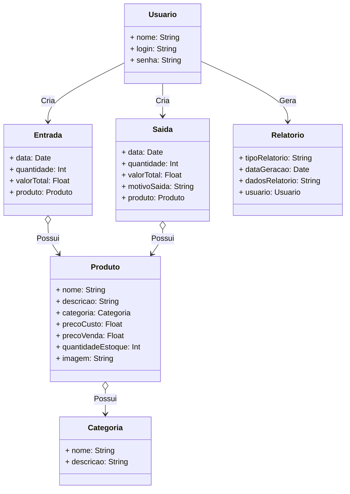
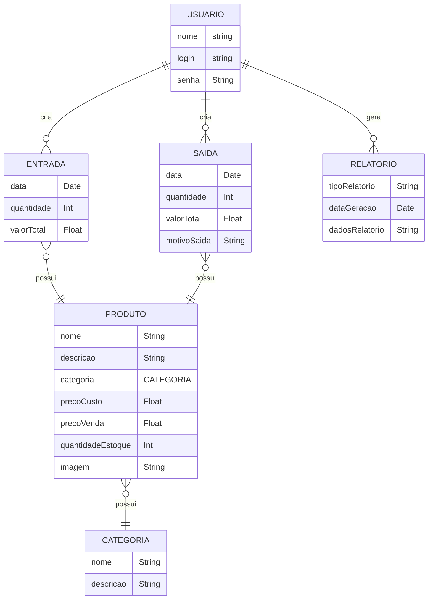
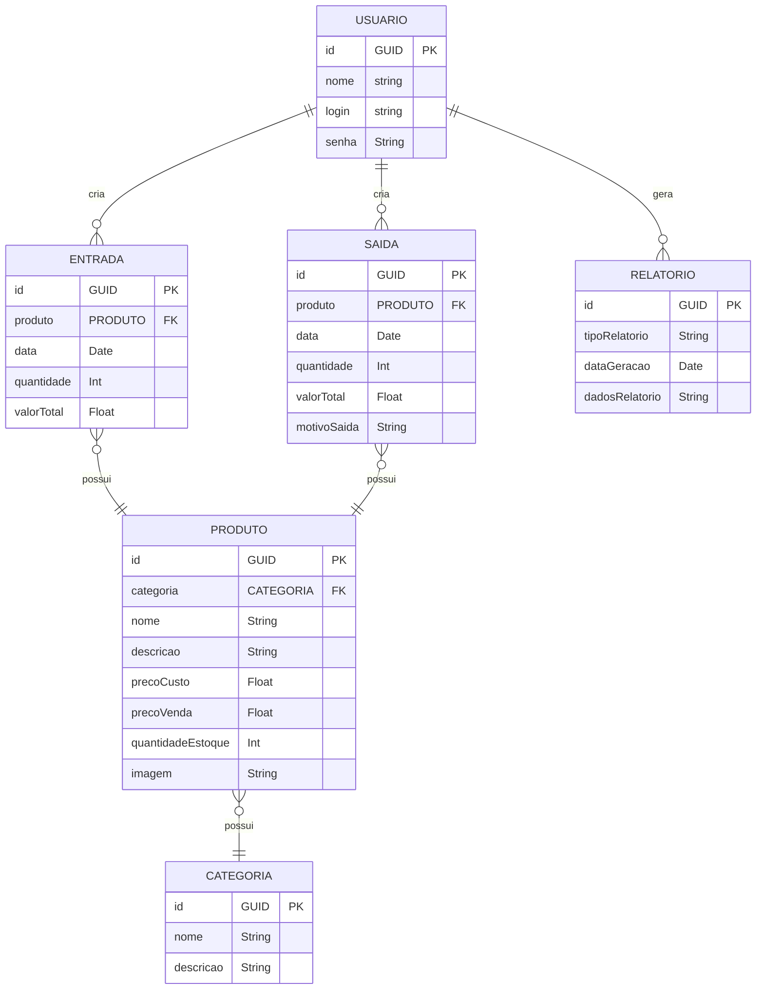

# Arquitetura da Solução

Definição de como o software é estruturado em termos dos componentes que fazem parte da solução e do ambiente de hospedagem da aplicação.

## Diagrama de Classes

O diagrama de classes ilustra graficamente como será a estrutura do software, e como cada uma das classes da sua estrutura estarão interligadas. Essas classes servem de modelo para materializar os objetos que executarão na memória.

## Modelo ER

O Modelo ER representa através de um diagrama como as entidades (coisas, objetos) se relacionam entre si na aplicação interativa.]

## Esquema Relacional

O Esquema Relacional corresponde à representação dos dados em tabelas juntamente com as restrições de integridade e chave primária.
 

## Modelo Físico

Entregar um arquivo banco.sql contendo os scripts de criação das tabelas do banco de dados. Este arquivo deverá ser incluído dentro da pasta src\bd.

## Tecnologias Utilizadas

1.  **Linguagem de Programação**:
    -   C#: Para o desenvolvimento Backend.
    -   Javascript: Para o desenvolvimento do Frontend.

2.  **Banco de Dados**:
    -   Mongo DB: Banco NoSQL orientado à documentos.
   
3.  **Autenticação**:
    -   Token JWT: Para gerenciar a autenticação de usuários com segurança.
    
4.  **IDE de Desenvolvimento**:
    -   Visual Studio Code: Uma IDE popular para o desenvolvimento.
    
5.  **Framework**:
    -   Entity Framework: Para integração com o banco de dados.
    -   React Js: Para o desenvolvimento do Frontend Web.
    -   React Native: Para o desenvolvimento dos aplicativos móveis multiplataforma.
  
7.  **Ferramentas de Design**:
    -   Figma: Para criar protótipos e layouts de interface de usuário.
  

## Hospedagem

O sistema será hospedado e lançado no Azure. 
Primeiro, configuramos um projeto Web App para o Backend e um para o Frontend. Em seguida, configuramos o banco de dados Azure Cosmos DB.

Utilizamos o Azure DevOps para implantar o sistema e garantir que ele seja acessível na Web. O Azure simplifica o processo de hospedagem e permite um lançamento com qualidade do sistema.

## Qualidade de Software

Conceituar qualidade de fato é uma tarefa complexa, mas ela pode ser vista como um método gerencial que através de procedimentos disseminados por toda a organização, busca garantir um produto final que satisfaça às expectativas dos stakeholders.

No contexto de desenvolvimento de software, qualidade pode ser entendida como um conjunto de características a serem satisfeitas, de modo que o produto de software atenda às necessidades de seus usuários. Entretanto, tal nível de satisfação nem sempre é alcançado de forma espontânea, devendo ser continuamente construído. Assim, a qualidade do produto depende fortemente do seu respectivo processo de desenvolvimento.

A norma internacional ISO/IEC 25010, que é uma atualização da ISO/IEC 9126, define oito características e 30 subcaracterísticas de qualidade para produtos de software.

| **Característica** | **Subcaracterística** | **Justificativa** | **Métricas** |
|---------------------|------------------------|--------------------|--------------|
| Funcionalidade | Adequação | Essencial para o controle de estoque. | Número de recursos essenciais implementados. |
| Usabilidade | Compreensibilidade | Usuários devem entender facilmente como usar o sistema. | Taxa de conclusão de tarefas de registro de produtos, tempo médio para aprendizado. |
| Confiabilidade | Tolerância a Falhas | Evitar perda de dados. | Tempo médio de indisponibilidade, capacidade de recuperação de dados em falhas. |
| Eficiência | Tempo de Resposta | Respostas rápidas são essenciais. | Tempo médio de resposta para ações comuns, como adicionar uma entrada de produtos. |
| Manutenibilidade | Modularidade | Facilita a manutenção e expansão. | Facilidade de adicionar/modificar funcionalidades sem afetar outras partes do app. |
| Portabilidade | Adaptabilidade | Funcionamento em diferentes dispositivos. | Testes bem-sucedidos em dispositivos e sistemas operacionais diferentes. |

